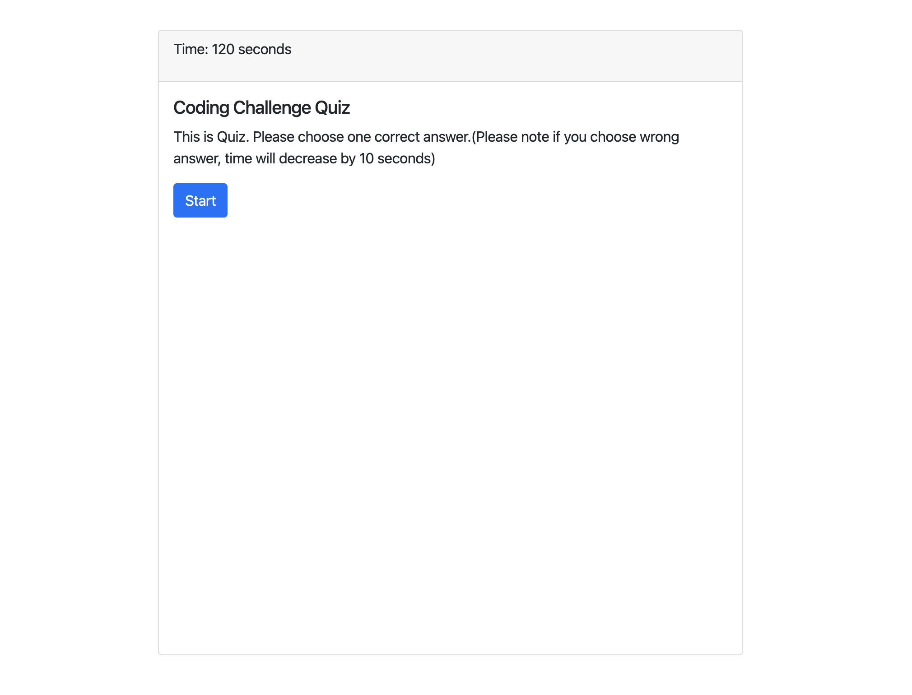

# Quiz project

## Description

This quiz consists of three simple quesitons. There is a timer for 120 seconds. If user choose wrong answer, the time will decrease by 10 seconds. If user choose correct answer, user will get 10 scores which will be displayed in top right corner. When user answers all the questions, user will be directed to enter initials which will be displayed in the list. Afterwards user can clear this list or navigate back to the quiz. 

### Link to the project
https://dmitrybalduev.github.io/quiz/

### Screenshot

